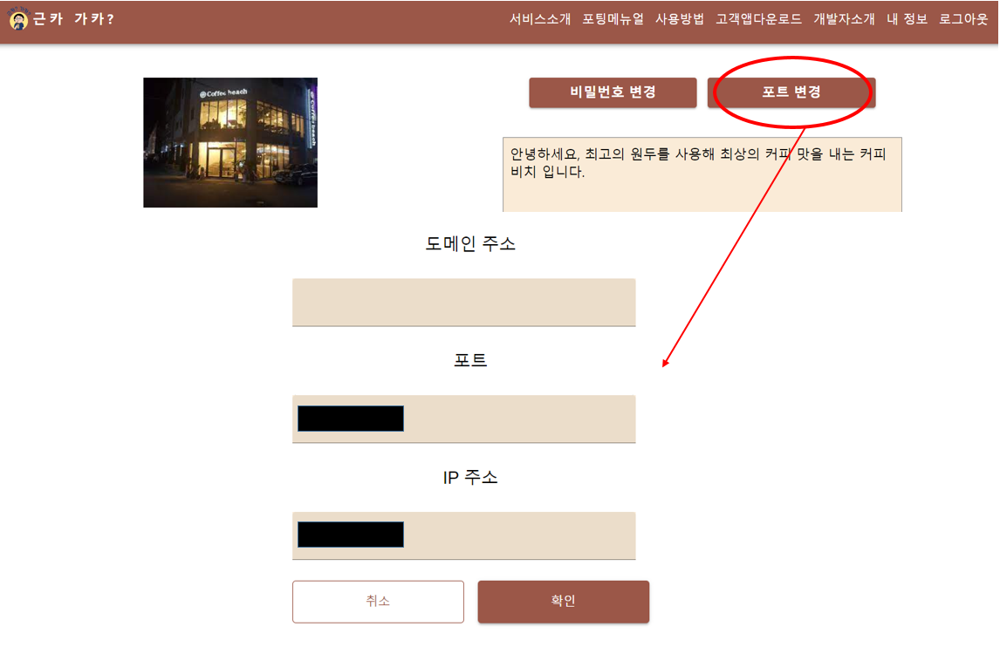

### 근카가카 - 근처카페, 가까운 카페 ☕
#### 개인카페 활성화를 위한 오픈소스 프로젝트

 
 

# 🔵 소상 공인들을 위한 오픈소스 플랫폼 근카가카

> 개발 기간 : 2023.10.09 ~ 2023.11.17 (총 6주)  
> 개발 인원 : 5인

 

## 📑 목차

1. 프로젝트 기획 배경
2. 주요기능 설명
3. 기술 스택
4. 아키텍처
5. 서비스 흐름도
6. ERD
7. 팀원 소개 및 역할

 

## 🚩 프로젝트 기획 배경

> 소상공인들의 경쟁력을 높이기 위한 오픈소스 플랫폼입니다.

프렌차이즈와 다르게 개인카페의 경우 자체적인 어플리케이션이 존재하지 않기 때문에 배달 중계 어플리케이션 사용이 필수적입니다. 
하지만 이러한 중개 어플리케이션은 높은 수수료 때문에 사용에 많은 부담이 있습니다.  
이를 해결하기 위해 공공 어플리케이션이 출시 되었지만 자체적인 인력의 부재로 인해 업데이트와 서비스 개선에 어려움이 있어 서비스가 종료되고 있는 현황입니다.  
저희는 이러한 문제점을 해결하고자 오픈소스 프로젝트 '근카가카'를 기획하였습니다. 
근카가카의 마이크로 사이트를 통해 카페 사장님들은 자유롭게 서비스에 참가할 수 있으며,
Deploy메뉴얼을 참고하여 손쉽게 개인 서버를 배포할 수 있습니다.  
사용자는 어플을 다운받아 카페 리스트를 확인하고, 메뉴를 확인 및 주문, 결제까지 가능합니다. 
이를 통해 개인카페에 대한 접근성이 높아지고, 사용자들의 편의성 향상을 기대할 수 있습니다.

 

## 🔎 주요 기능 설명

### 1️⃣ [마이크로 사이트](https://gunkagaka.store/)
|||
|-----------|-----------|
|      - 마이크로 사이트에서 서비스에 관한 상세 설명을 확인할 수 있습니다.   |   - 사업자 인증 절차를 걸쳐 회원가입을 진행할 수 있습니다. |
|    - 승인 완료 후 로그인 하면 가게 정보를 등록/수정할수 있습니다.   |    - 상단의 사용 메뉴얼을 통해 서비스 이용을 더욱 편리하게 할 수 있습니다. |
|   - 포트번호 설정 : 중앙 서버가 다운 되더라도 사장님 서버에 직접 접속할 수 있도록 IP와 도메인을 등록할 수 있습니다. |    |

### 2️⃣ 관리자 사이트
|||
|-----------|-----------|
|     - 사업자 인증을 검토하고 승인을 수행할수 있습니다.  - 승인 완료/미완료/전체의 분류로 사업자를 확인할 수 있습니다. |   - 신청한 가게 정보를 확인할 수 있습니다.|

### 3️⃣ 주문 접수 웹 사이트

|||
|-----------|-----------|
|      - 웹 사이트에서 주문을 상태별로 관리할 수 있습니다.  |   - 주문 취소/접수 접수가 가능하며 취소시 사유를 선택할 수 있습니다.|
|    - SSE를 통해 주문이 들어온 경우 알림을 받을 수 있습니다.  |    - 메뉴를 수정 및 등록할 수 있습니다.   - 메뉴의 품절 여부를 설정할 수 있습니다.  |

### 4️⃣ [손님 모바일 어플리케이션](https://play.google.com/store/apps/details?id=com.sudurukbackback.guncagaca)

||||
|-----------|-----------|-----------|
|      - 현재 위치 주변의 카페를 확인할 수 있습니다.  |   - 카페 상세 조회를 통해 메뉴, 소개, 리뷰를 확인할 수 있습니다.|    - 메뉴의 옵션을 선택하고 장바구니에 담을 수 있습니다.|
|    - 장바구니에서는 도착예정시간 및 수령방법 선택과 개수 변경이 가능합니다.  |    - 다양한 결제 수단을 사용하여 결제를 진행할 수 있습니다.  |   - 주문내역에서 현재 진행중인 주문의 상태확인, 완료한 주문의 상세 내역, 리뷰 작성을 할 수 있습니다.   - 주문 상태가 변경되면 알림을 통해 확인할 수 있습니다. |
|   - 마이페이지를 통해 주문내역, 리뷰내역, 찜 가게를 조회할 수 있습니다.   - 가게별 최근 주문내역과 포인트를 확인할 수 있습니다.||

 

## 🛠 기술스택

<table>
<tr>
 <td align="center">언어</td>
 <td>
  
  
 
    
	
 </td>
</tr>
<tr>
 <td align="center">프레임워크</td>
 <td>
    
      
    
        

</tr>
<tr>
 <td align="center">라이브러리</td>
 <td>
  

    

</tr>
<tr>
 <td align="center">패키지 매니저</td>
 <td>
    
    

  </td>
</tr>
<tr>
 <td align="center">인프라</td>
 <td>
  
  
  
  
  
  
  
  
       
</tr>
<tr>
 <td align="center">포맷팅</td>
 <td>
   
    
  </td>
</tr>

<tr>
 <td align="center">협업툴</td>
 <td>
    
     
     
     
    
 </td>
</tr>
<tr>
 <td align="center">기타</td>
 <td>
    
     
    
    
 </td>
</tr>
</table>

 

## 🧱아키텍처

 

## 📽️서비스 흐름도

 

## 🗂ERD

 

## 🧚‍♀️팀원 소개 및 역할

|    NAME   | 기능 및 역할                                                                                                                                                                                                                                                                                                                                                                                                                                   |
| ------------------| ---------------------------------------------------------------------------------------------------------------------------------------------------------------------------------------------------------------------------------------------------------------------------------------------------------------------------------------------------------------------------------------------------------------------------------------------- |
| 최영태 | 팀장 Frontend : 홈 화면, 카페 상세 화면, 장바구니, Bootpay 결제 연동, 주문내역 화면, 리뷰 화면  Backend : Kafka 이벤트 처리, 카페 리스트 및 상세 조회, 결제 취소, 메뉴 등록 및 조회, 주문 상태 관리, 주문 내역 조회 및 SSE 업데이트  인프라: Docker, MSA 아키텍처 구현, 데이터베이스 설계                                                                                                                                           |
| 김제준 | 프론트엔드: 사업주페이지 UI/UX, 주문내역 SSE, 주문내역 조회, 주문 처리, 주문 대기, 주문 완료, 사용자애플리케이션 UI/UX, 마이페이지, 메뉴 상세, 메뉴 디테일, 주문 내역, 포인트함, 찜 목록, 닉네임 변경, 로그아웃, 알림함, 검색, 네비게이터, 리뷰 쓰기, 리뷰 페이지, fcm, 로그인 백엔드: 찜, 리뷰, 포인트, 주문                                                                                                                              |
| 권민재 | 프론트엔드 : 로그인, 파일업로드, 사장님[마이페이지 통신, 리뷰 화면 통신, 메뉴 (등록,수정, 전체보기, 삭제, 상태관리) 통신, 주문관리 통신]화면, 사장님 웹페이지 디자인   백엔드 : 마이페이지 통계, 메뉴 상태 관리                                                                                                                                                                                                                            |
| 이기표 | 프론트엔드 : 소셜 로그인 기능 및 통신, 앱 배포   백엔드 : 회원 관리, 주문 등록 및 관리, 메뉴 등록 및 관리, 데이터 동기화(Kafka)  인프라 : MSA 환경 구축 및 관리(Gateway, Eureka, Config) 서버 배포(Docker, EC2), 시스템 아키텍처 구현, CI/CD(Jenkins)                                                                                                                                                                                  |
| 서은진 | 백엔드(web) : 데이터베이스 설계, Config Server, 공공API를 이용한 사업자 인증, JWT토큰 발급 및 저장, 회원가입/로그인, 가게 정보 수정, 관리자 인증, 마이페이지, Gateway 환경 설정, 메뉴 상태별 조회, 메뉴 상태 관리, FCM 백엔드(App) : 자동 로그인 구현   프론트엔드 : Micro-site 전체 제작, 관리자 사이트 전체 제작  인프라 : Docker, Jenkins(CI/CD 파이프라인 구축), MSA 아키텍처 구현, nginx, node.js를 이용해 관리자 사이트 배포 |
