# 1. 개발 환경

### 1.1 Front-end

- v14.17.0
- React 18.2.0

### 1.2 Back-end

- openjdk 11 2018-09-25
- Spring Boot 2.7.16-SNAPSHOT
- Gradle 8.2.1

### 1.3 DB

- Redis 7.2.1
- MongoDB 7.0.1
- MySQL 8.1.0

### 1.4 시스템

- Ubuntu 20.04.3
- Nginx 1.18.0
- Docker 24.0.6
- Jenkins 2.414.1

### 1.5 IDE

- IntelliJ IDEA 2023.1.3 (Ultimate Edition)
- Visual Studio Code

### 1.6 형상 / 이슈 관리

- Gitlab
- Jira
- Notion

### 그 외

- S3

# 2. 환경 변수

```javascript
spring:
  application:
    name: admin
  profiles:
    active: dev
  config:
    import: optional:configserver:http:{url}

server:
  port: 9999

management:
  endpoints:
    web:
      exposure:
        include: "*"

logging:
  level:
    org.hibernate.type: trace
```

# 3. EC2 설정

## 3.1 Docker 설치

1. 우분투 시스템 패키지 업데이트

```bash
sudo apt-get update
```

2. 필요한 패키지 설치

```bash
sudo apt-get install apt-transport-https ca-certificates curl gnupg-agent software-properties-common
```

3. Docker의 공식 GPG키를 추가

```bash
curl -fsSL https://download.docker.com/linux/ubuntu/gpg | sudo apt-key add -
```

4. Docker의 공식 apt 저장소를 추가

```bash
sudo add-apt-repository "deb [arch=amd64] https://download.docker.com/linux/ubuntu $(lsb_release -cs) stable"
```

5. 시스템 패키지 업데이트

```bash
sudo apt-get update
```

6. Docker 설치

```bash
sudo apt-get install docker-ce docker-ce-cli containerd.io
```

## 3.2 Nginx

1. Nginx 설치

```bash
sudo apt-get install nginx
```

2. Let's Encrypt 설치 및 SSL 발급

```bash
sudo apt-get install letsencrypt
sudo systemctl stop nginx
sudo letsencrypt certonly --standalone -d 도메인명

.... 이메일 입력 및 절차 진행
```

3. Nginx 설정

```bash
cd /etc/nginx/sites-available
sudo nano default
```

```plaintext
# 설정 파일 변경
server {
	listen 443 ssl default_server;
	listen [::]:443 ssl default_server;


	ssl_certificate /etc/letsencrypt/live/도메인/fullchain.pem;
	ssl_certificate_key /etc/letsencrypt/live/도메인/privkey.pem;
	ssl_protocols TLSv1 TLSv1.1 TLSv1.2;
	ssl_ciphers HIGH:!aNULL:!MD5;

	root /home/ubuntu/nashda/build;

	index index.html index.htm index.nginx-debian.html;
	client_max_body_size 300M;
	server_name _;

	location /api/ {
		proxy_pass http://localhost:8000/;
	}


}

server {
	listen 80;
	listen [::]:80;

	server_name {도메인};

	return 301 https: //{도메인};
}

```

4. nodejs 설치

```bash
sudo apt-get install -y curl
sudo apt update
sudo apt install nodejs
nodejs -v
sudo apt install npm
```

## MongoDB

1. MongoDB 이미지 받아오기

```bash
sudo docker pull mongodb
```

2. MongoDB 컨테이너 실행

```bash
docker run --name mongodb -v /data/db:/data/db -d -p 27017:27017 mongo --auth
```

3. MongoDB 설정

```bash
sudo docker exec -it mongodb /bin/bash
mongosh
use admin
db.createUser({ user: "{user_id}", pwd: "{password}",  roles: ["root"] });
```

- auth 에러시 DB에 대한 권한 부여

```bash
db.updateUser("{user_id}", { roles : [{role :  "root", db : "admin"}, {role : "readWrite", db : "{db이름"}]});
```

## 3.3 Jenkins

1. 젠킨스 설치

```bash
curl -fsSL https://pkg.jenkins.io/debian-stable/jenkins.io-2023.key | sudo tee \
  /usr/share/keyrings/jenkins-keyring.asc > /dev/null
echo deb [signed-by=/usr/share/keyrings/jenkins-keyring.asc] \
  https://pkg.jenkins.io/debian-stable binary/ | sudo tee \
  /etc/apt/sources.list.d/jenkins.list > /dev/null
sudo apt-get update
sudo apt-get install jenkins
```

- 인증 안되면 ca-certificates 설치 해보기

```bash
sudo apt install ca-certificates
```

## 3.4 redis

1. redis 이미지 받아오기

```bash
docker pull redis:alpine
```

2. redis 컨테이너 실행

```bash
docker run -d -p 6379:6379 --name=redis redis:alpine
```

## 3.5 MySQL

1. MySQL 이미지 받아오기

```bash
docker pull mysql
```

2. MySQL 컨테이너 실행

```bash
docker run -d -p 3306:3306 -e MYSQL_ROOT_PASSWORD={password} --name mysql mysql:latest --character-set-server=utf8mb4 --collation-server=utf8mb4_unicode_ci
```

## 3.6 포트 번호

| 포트 번호 | 내용        |
| --------- | ----------- |
| 80        | HTTP        |
| 443       | HTTPS       |
| 9090      | Jenkins     |
| 8761      | Eureka      |
| 8000      | Gateway     |
| 8081      | 사용자 서버 |
| 8082      | 알림 서버   |
| 8083      | 주문 서버   |
| 8085      | 업체 서버   |
| 9999      | 관리자 서버 |
| 6379      | Redis       |
| 3306~3310 | MySQL       |
| 27017     | MongoDB     |

## 3.7 S3 설정

1. 관리 콘솔에 로그인 후 S3 접속
   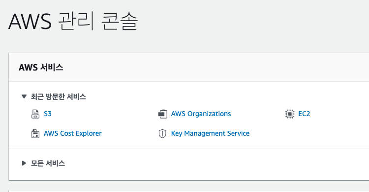

2. 우측의 버킷 만들기 클릭
   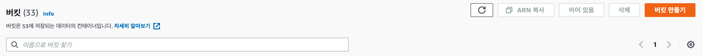

3. 이름, 리전 설정
   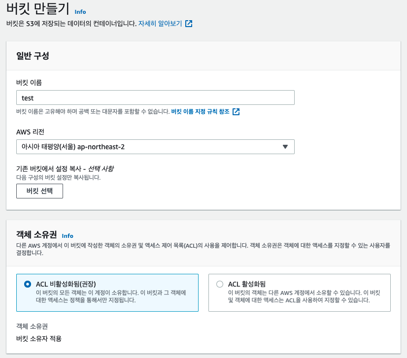

4. 퍼블릭 설정
   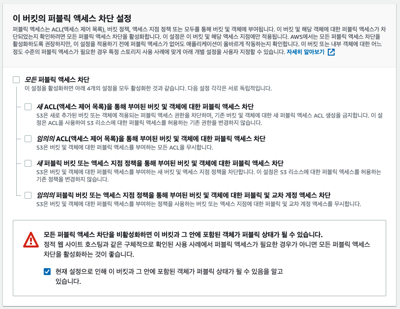

5. 버킷 만들기
   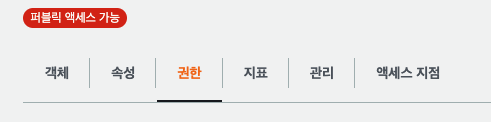

6. 버킷 정책 만들기
   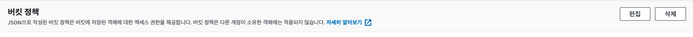
   ```
   {
     "Version": "2012-10-17",
     "Id": "Policy1695907050555",
     "Statement": [
         {
             "Sid": "Stmt1695907005761",
             "Effect": "Allow",
             "Principal": "*",
             "Action": "s3:*",
             "Resource": "arn:aws:s3:::nashda/*"
         }
     ]
   }
   ```

## 4. 백엔드 배포

- Jenkins 페이지 진입
  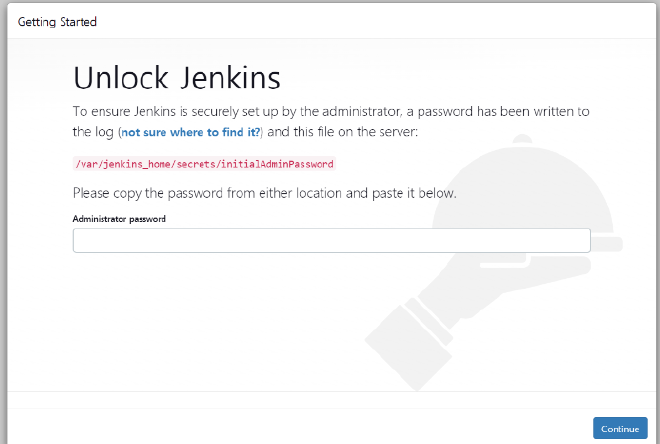
  `초기 비밀번호의 경우 /var/jenkins_home/secrets/initialAdminPassword 에 있음`
- Plugin 전부 설치
  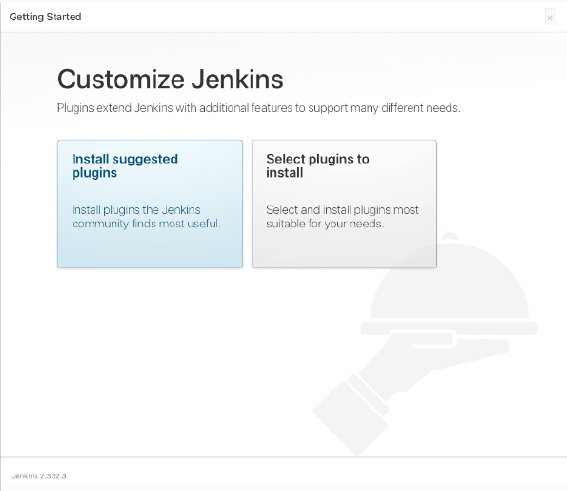

- 계정을 생성
  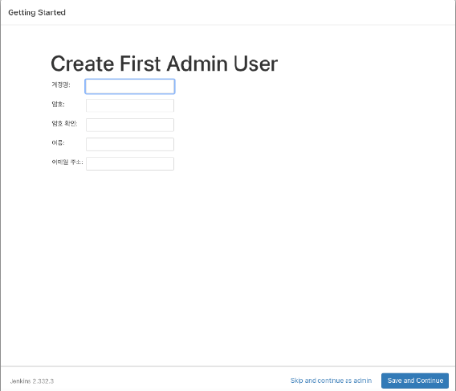

- gitlab을 사용 시 gitlab을 연결하기 위한 토큰을 생성
  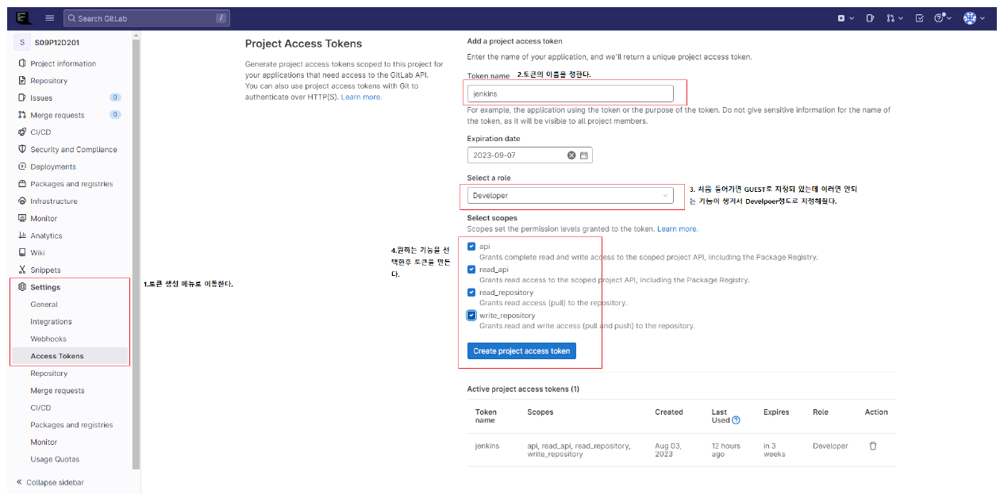

- plugins에 들어가서 available plugins에 들어가 gitlab과 ssh agent, docker를 설치
  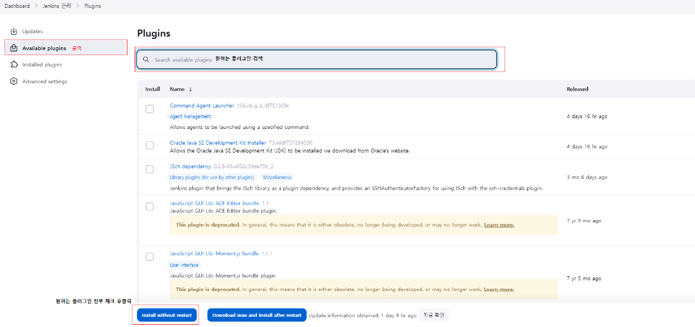

- 젠킨스에 접속해서 로그인 후 jenkins관리로 이동 후 Credentials를 클릭
  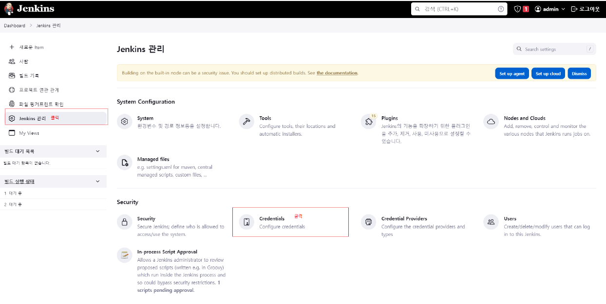

- 새로운 Credentials를 만들어 준다
  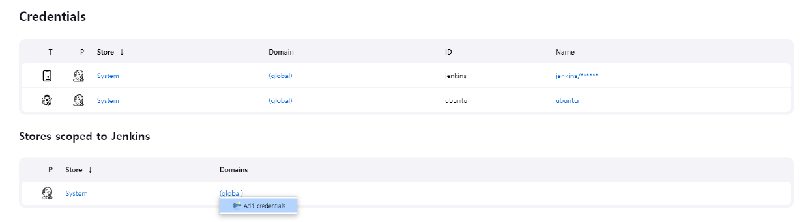

- 발급 받은 토큰을 jenkins에 등록
  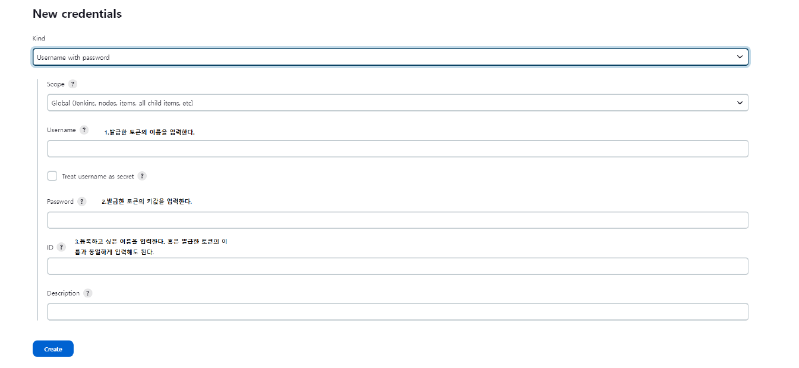

- 이제 메인 페이지에서 새로운 item을 클릭하고 pipeline을 선택 후 원하는 이름으로 설정
- 구성의 소스코드 관리로 이동하여 git을 클릭하고 git 주소, 등록한 git토큰 배포할 브런치를 선택한다
  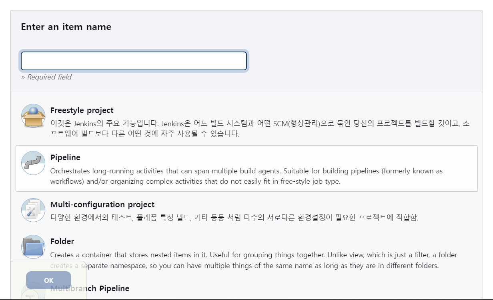
  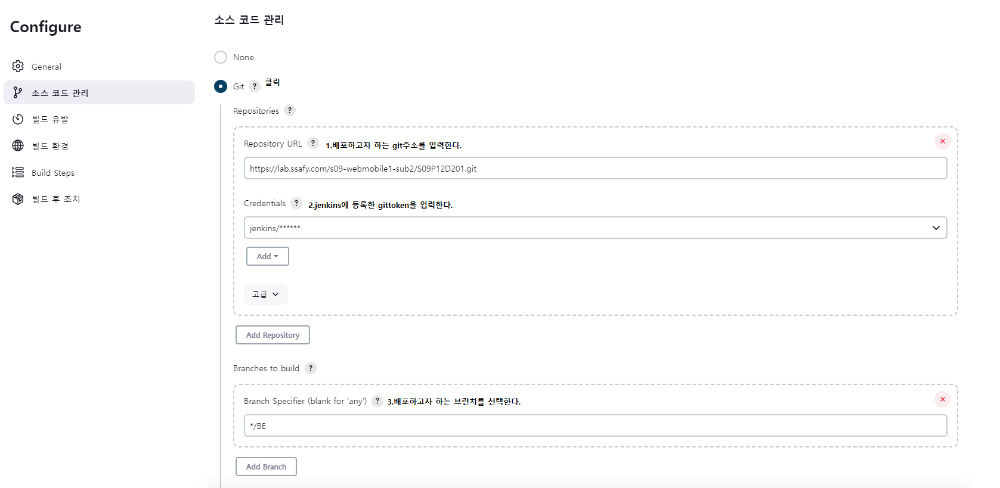

- 빌드 유발로 이동하여 webhook설정 (선택)
  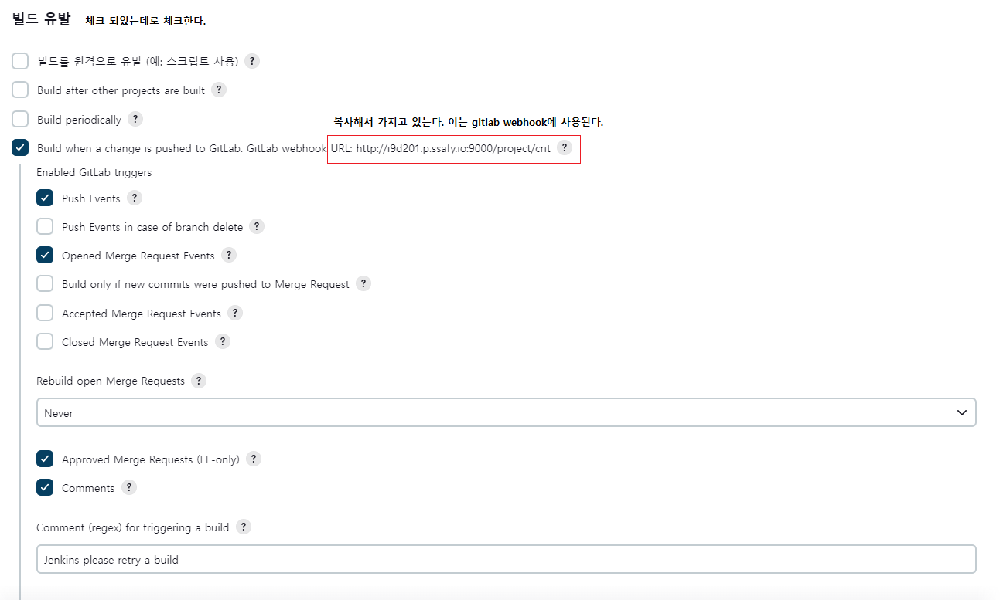
  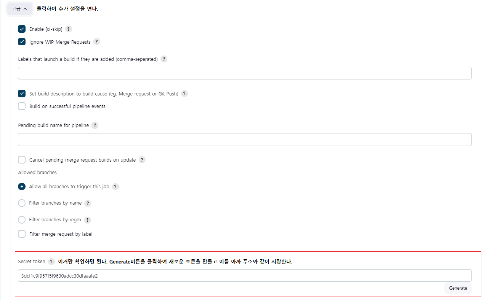

- gitlab에서 webhook을 등록하고 jenkins 와 연결
  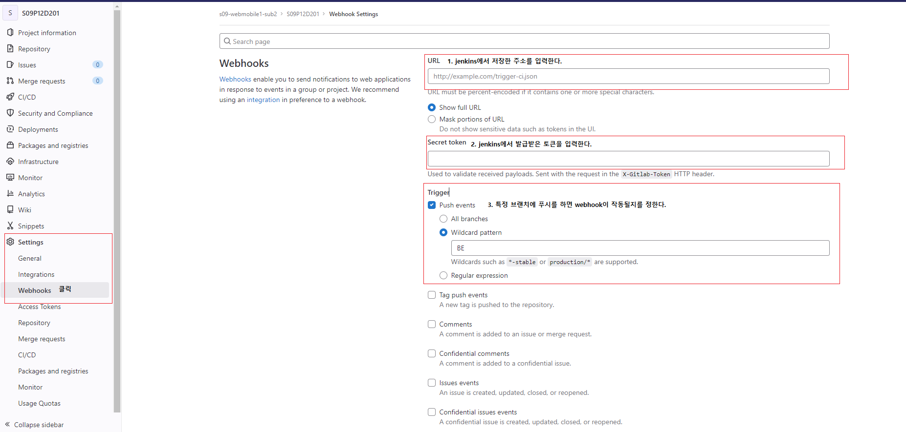

- 등록을 하면 밑에 나타나게 되는데 Test - push events를 클릭하면 테스트가 진행되고 위에 결과가 http 200이면 연결 성공
  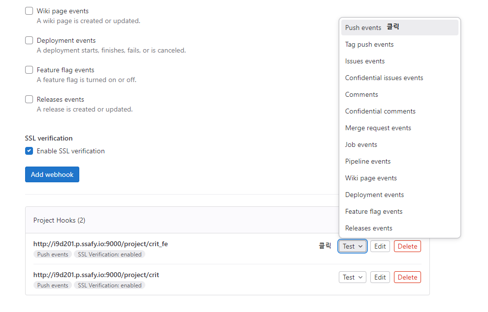

- pipeline으로 이동하여 pipeline script를 클릭하여 다음과 같은 코드를 입력
  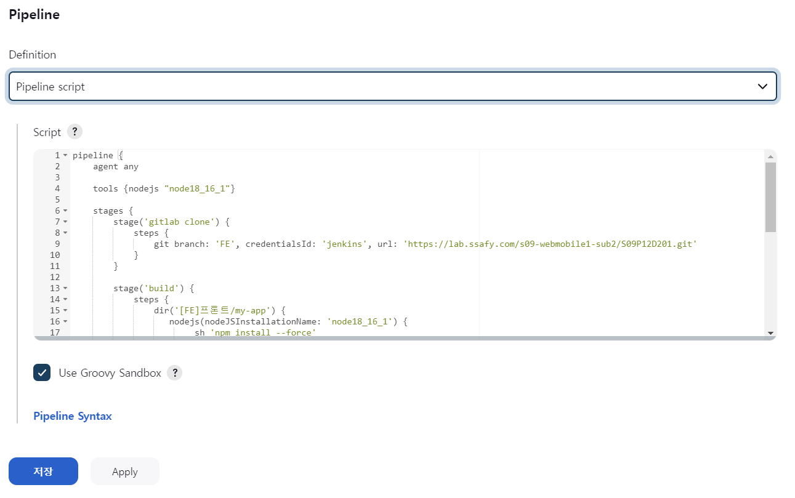

1. config server : 의존성을 정의하므로 가장 먼저 실행되어야 한다.

```bash
pipeline {
    agent {
        any {
            // 젠킨스에서 사용할 Docker 이미지 설정
            // 여기서는 Gradle과 Java가 설치된 이미지를 사용합니다.
            image 'gradle:jdk11'
        }
    }

    environment {
        // 빌드 결과물이 저장될 경로
        BUILD_DIR = "/var/d102/backend"
        DOCKER_CONTAINER_NAME = "config-service"
    }

    stages {

        stage('Git Clone') {
            steps {
                git branch: 'backend-config',
                credentialsId: 'thisiseunjin',
                url: 'https://lab.ssafy.com/s09-final/S09P31D102'
            }
        }


        stage('Build') {
            steps {
                sh 'pwd'
                sh 'ls -al'

                // jar 파일 삭제
                sh 'rm build/libs/*.jar | true'

                dir('backend/config-server'){
                    // 스프링 빌드
                    sh 'pwd'
                    sh 'ls -al'
                    sh 'chmod +x gradlew'
                    sh './gradlew clean bootJar'

                    // 도커 이미지 빌드
                    sh 'docker build -t thisiseunjin/config-service .'

                    sh 'docker images'
                }
            }
        }


        stage('Deploy') {
            steps {
                // 기존 서버 중지
                sh "docker stop $DOCKER_CONTAINER_NAME || true"  // 기존 컨테이너가 없을 경우를 위해 무시

                sh "docker rm $DOCKER_CONTAINER_NAME || true"  //중지된 서버 삭제


                // 빌드된 파일을 원하는 위치로 배포
                // 예: 서버에 배포하는 경우
                sh "whoami"
                sh "groups"

                //sh 'docker pull thisiseunjin/config-service:latest'

                // 쓰레기 이미지 삭제

                // 새로운 서버 실행
                //sh "docker run -d -p 8888:8888 -e TZ=Asia/Seoul --name $DOCKER_CONTAINER_NAME thisiseunjin/config-service"
                 sh """docker run -d -p 8888:8888 \
                  -e TZ=Asia/Seoul \
                  --network=service_network \
                  --name $DOCKER_CONTAINER_NAME thisiseunjin/config-service"""


                sh 'docker images -f dangling=true -q | xargs -r docker rmi'
                //docker images -f dangling=true -q | xargs -r docker rmi

            }
        }
    }
}
```

2. eurake server

```bash
pipeline {
    agent {
        any {
            // 젠킨스에서 사용할 Docker 이미지 설정
            // 여기서는 Gradle과 Java가 설치된 이미지를 사용합니다.
            image 'gradle:jdk11'
        }
    }

    environment {
        // 빌드 결과물이 저장될 경로
        BUILD_DIR = "/var/d102/backend"
        DOCKER_CONTAINER_NAME = "eureka-service"
    }

    stages {

        stage('Git Clone') {
            steps {
                git branch: 'backend-eureka',
                credentialsId: 'thisiseunjin',
                url: 'https://lab.ssafy.com/s09-final/S09P31D102'
            }
        }


        stage('checking Config'){
            steps{
                script {
                    //def inspectResult = sh(script: "docker inspect --format '{{{{.State.Running}}}}' config-service", returnStatus: true, returnStdout: true).trim()
                   def inspectResult = sh(script: 'docker inspect --format="{{.State.Running}}" config-service', returnStatus: true)

                    if (inspectResult == "1" || inspectResult == "false") {
                     // config-server 컨테이너가 존재하지 않거나 실행 중이지 않은 경우
                     build job: 'config-server', wait: true
                    }
                }
            }
        }

        stage('Build') {
            steps {
                sh 'pwd'
                sh 'ls -al'

                // jar 파일 삭제
                sh 'rm build/libs/*.jar | true'

                dir('backend/eureka-service'){
                    // 스프링 빌드
                    sh 'pwd'
                    sh 'ls -al'
                    sh 'chmod +x gradlew'
                    sh './gradlew clean bootJar'

                    // 도커 이미지 빌드
                    sh 'docker build -t thisiseunjin/eureka-service:latest .'

                    sh 'docker images'
                }
            }
        }


        stage('Deploy') {
            steps {
                // 기존 서버 중지
                sh "docker stop $DOCKER_CONTAINER_NAME || true"  // 기존 컨테이너가 없을 경우를 위해 무시

                sh "docker rm $DOCKER_CONTAINER_NAME || true"  //중지된 서버 삭제


                // 빌드된 파일을 원하는 위치로 배포
                // 예: 서버에 배포하는 경우
                sh "whoami"
                sh "groups"

                // sh 'docker pull thisiseunjin/eureka-service:latest'
                // 새로운 서버 실행
                //sh "docker run -d -p 8761:8761 -e TZ=Asia/Seoul --name $DOCKER_CONTAINER_NAME thisiseunjin/eureka-service"
                 sh """docker run -d -p 8761:8761 \
                  -e TZ=Asia/Seoul \
                  --network=service_network \
                  --name $DOCKER_CONTAINER_NAME thisiseunjin/eureka-service"""

                // 쓰레기 이미지 삭제
                sh 'docker images -f dangling=true -q | xargs -r docker rmi'
            }
        }
    }
}
```

3. gateway

```bash
pipeline {
    agent {
        any {
            // 젠킨스에서 사용할 Docker 이미지 설정
            // 여기서는 Gradle과 Java가 설치된 이미지를 사용합니다.
            image 'gradle:jdk11'
        }
    }

    environment {
        // 빌드 결과물이 저장될 경로
        BUILD_DIR = "/var/d102/backend"
        DOCKER_CONTAINER_NAME = "gateway-service"
    }

    stages {

        stage('Git Clone') {
            steps {
                git branch: 'backend-gateway',
                credentialsId: 'thisiseunjin',
                url: 'https://lab.ssafy.com/s09-final/S09P31D102'
            }
        }


        stage('Checking Eureka'){
            steps{
                script {
                    //def inspectResult = sh(script: "docker inspect --format '{{{{.State.Running}}}}' config-service", returnStatus: true, returnStdout: true).trim()
                    def inspectResult = sh(script: 'docker inspect --format="{{.State.Running}}" eureka-service', returnStatus: true)

                    if (inspectResult == "1" || inspectResult == "false") {
                     // config-server 컨테이너가 존재하지 않거나 실행 중이지 않은 경우
                     build job: 'eureka-service', wait: true
                    }
                }
            }
        }

        stage('Build') {
            steps {
                sh 'pwd'
                sh 'ls -al'

                // jar 파일 삭제
                sh 'rm build/libs/*.jar | true'

                dir('backend/gateway-service'){
                    // 스프링 빌드
                    sh 'pwd'
                    sh 'ls -al'
                    sh 'chmod +x gradlew'
                    //sh './gradlew clean build'
                    sh './gradlew clean bootJar'


                    // 도커 이미지 빌드
                    sh 'docker build -t thisiseunjin/gateway-service:latest .'

                    sh 'docker images'
                }
            }
        }


        stage('Deploy') {
            steps {
                // 기존 서버 중지
                sh "docker stop $DOCKER_CONTAINER_NAME || true"  // 기존 컨테이너가 없을 경우를 위해 무시

                sh "docker rm $DOCKER_CONTAINER_NAME || true"  //중지된 서버 삭제


                // 빌드된 파일을 원하는 위치로 배포
                // 예: 서버에 배포하는 경우
                sh "whoami"
                sh "groups"

                //sh 'docker pull thisiseunjin/gateway-service:latest'

                // 새로운 서버 실행
                //sh "docker run -d -p 8000:8000 -e TZ=Asia/Seoul --name $DOCKER_CONTAINER_NAME thisiseunjin/gateway-service"
                sh """docker run -d -p 8000:8000 \
                  -e TZ=Asia/Seoul \
                  -e DISCOVERY_SERVICE_URL=http://eureka-service:8761/eureka/ \
                  --network=service_network \
                  --name $DOCKER_CONTAINER_NAME thisiseunjin/gateway-service"""

                // 쓰레기 이미지 삭제
                sh 'docker images -f dangling=true -q | xargs -r docker rmi'
            }
        }
    }
}
```

4. 서비스 파일

```bash
pipeline {
    agent {
        any {
            // 젠킨스에서 사용할 Docker 이미지 설정
            // 여기서는 Gradle과 Java가 설치된 이미지를 사용합니다.
            image 'gradle:jdk11'
        }
    }

    environment {
        // 빌드 결과물이 저장될 경로
        BUILD_DIR = "/var/{폴더명1}/{폴더명2}"
        DOCKER_CONTAINER_NAME = "{docker container 이름}"
    }

    stages {

        stage('Git Clone') {
            steps {
                git branch: '{branch 명}',
                credentialsId: '{jenkins}',
                url: 'https://{gitlab url}'
            }
        }

        stage('checking Gateway'){
            steps{
                script {
                   def inspectResult = sh(script: 'docker inspect --format="{{.State.Running}}" gateway-service', returnStatus: true)

                    if (inspectResult == "1" || inspectResult == "false") {
                     // gateway-serveice 컨테이너가 존재하지 않거나 실행 중이지 않은 경우
                     build job: 'gateway-service', wait: true
                    }
                }
            }
        }

        stage('Build') {
            steps {
                sh 'pwd'
                sh 'ls -al'

                // jar 파일 삭제
                sh 'rm build/libs/*.jar | true'

                dir('backend/admin-service'){
                    // 스프링 빌드
                    sh 'pwd'
                    sh 'ls -al'
                    sh 'chmod +x gradlew'
                    sh './gradlew clean bootJar'

                    // 도커 이미지 빌드
                    sh 'docker build -t {docke 아이디}/{이미지 명}:latest .'

                    sh 'docker images'
                }
            }
        }


        stage('Deploy') {
            steps {
                // 기존 서버 중지
                sh "docker stop $DOCKER_CONTAINER_NAME || true"  // 기존 컨테이너가 없을 경우를 위해 무시

                sh "docker rm $DOCKER_CONTAINER_NAME || true"  //중지된 서버 삭제


                // 빌드된 파일을 원하는 위치로 배포
                // 예: 서버에 배포하는 경우
                sh "whoami"
                sh "groups"


                // 새로운 서버 실행
                 sh """docker run -d -p {포트번호}:{포트번호} \
                  -e TZ=Asia/Seoul \
                  -e DISCOVERY_SERVICE_URL={유레카 서버 url} \
                  --network=service_network \
                  --name $DOCKER_CONTAINER_NAME {docker 아이디}/{이미지명}"""

                // 쓰레기 이미지 삭제
                sh 'docker images -f dangling=true -q | xargs -r docker rmi'
            }
        }
    }
}
```

- webhook으로 특정 branch에 push event발생시 자동 배포 구축

## Front 배포

1. 웹페이지를 올리고자 하는 git repo를 클론 해 줍니다.

```bash
git clone repo주소
```

2. 우분투 서버에 node 설치

```bash
curl -sL https://deb.nodesource.com/setup_14.x | sudo bash -
sudo apt-get install nodejs
```

3. 설치 확인

```bash
node -v
```

4. clone 했던 곳에 가서 `npm install` 을 해줍니다.
5. `npm run build`로 build를 진행해줍니다.
6. EC2 에서 웹페이지 배포를 하려면 웹서버를 설치

```bash
npm install express
```

7. 웹페이지가 있는 프로젝트의 폴더로 이동합니다.
8. server js파일 생성 `vi server.js`

```javascript
const http = require("http");
const express = require("express");
const path = require("path");

const app = express();

const port = { 포트번호 };

app.get("/ping", (req, res) => {
  res.send("pong");
});

app.use(express.static(path.join(__dirname, "build")));

app.get("/*", (req, res) => {
  res.set({
    "Cache-Control": "no-cache, no-store, must-revalidate",
    Pragma: "no-cache",
    Date: Date.now(),
  });
  res.sendFile(path.join(__dirname, "build", "index.html"));
});

http.createServer(app).listen(port, () => {
  console.log(`app listening at ${port}`);
});
```
9. 백그라운드에서 실행 : npm forever사용
- 설치 : `sudo npm install forever -g`
- 실행 : `sudo forever start server.js`
